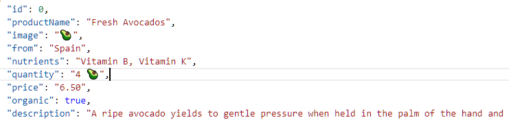

### Install Node.js:


 

 
 After you install node.js on your local machine test it in CMD – node -v (should display the version) 
 ```html
 C:\Users\aygun>node -v         ->  v10.16.3 
 ``` 
 <br/>
 
### Introduction to Node.js and NPM

-	Node.js is a JavaScript Runtime build on Google’s open source V8 JavaScript Engine. 
-	Node.js enables JavaScript to be run in a different environment than just the browser.
-	The V8 Engine executes the code – parse it and runs it in Node.js

 
 <br/> 
 

### What is Node.js


#### Running JavaScript Outside the Browser

-	Start interacting with node in the command line; - we are going to use the build in terminal
	- Type-in **node**  -> this will open up *Node REPL* (Read-Evaluate-Print-Loop). It is very handy when we want to quickly test a JavaScript code snippet. 
    - To exit REPL type in .exit or Ctrl + D
    - Hit tab tab and you will see all the global variables that are available in Node
    - When you type in an underscore will give you the previous output to use.
    - Type in String. tab tag will give you the methods of the String class

#### Using Modules: Core Modules

-	Start a new .js file in the root directory
-	Type in some JavaScript code.
-	To run this file in the browser we would have to attach it to an html file;  
    but this is how we could run JavaScript in Node:  
	- In the Terminal -> command node and the name of the file.
-	More advanced features of Node would be reading files from the files system for example.  
    In order to that we would need to use a ***Node Module***	– all kind of functionality is stored in Modules; in this case it would be the *fs module (file stream)*.  
	To make use of these modules we ***require*** them into our code and then store the result of the requiring function in a variable.
const fs = require('fs');

#### Node Documentations:

  
<br/>


### Reading and Writing Files Synchronosly (blocking):


``` javascript
    const fs = require('fs');
	
// Read from file synchronosly:
	const textIn = fs.readFileSync('./txt/input.txt','utf-8');
	console.log(textIn);

// Write to file synchronosly:	
// ES6 syntax:
	const textOut = `This is what we know about the avocato: ${textIn}.\nCreated on ${Date.now()}`;
// Previous Syntax without the backstrings: - 'this is: ' + textIn;
	fs.writeFileSync('./txt/output.txt',textOut);
	console.log('File written');
```  
<br/>


### Blocking and Non-Blocking: Asynchronous Nature of Node.js

- Non-Blocking I/O model (asynchronous read function) - won't block the one single thread; the heavy work is done in the background; where it stays until it’s finished reading the data from the file.
- We then register a *callback function* to be called once the data is available.  
  All other users can perform their tasks in a single thread one after another while the file is still being read in the background. In PHP you get one thread for each user.
- A callback in our code does not make it automatically asynchronous. Passing functions in another functions is common in JavaScript. 


#### Callback Hell 
The callback model - function is called once the one before has finished its work; this can quickly lead to some hard to read and manageable code. 
#### Example:
The second file read depends on the first one; than the third file read depends on the second one; and then the finally we want to use the final data to write as a result.  
This makes it hard to read and reason about. This problem is called ***Callback Hell***. To solve this problem, we can use *ES6 Promises or ES8 async/await*. 
```javascript
const fs = require('fs');

// callback hell example:

fs.writeFile('start.txt', 'utf-8', (err,data1) => {
    fs.writeFile(`${data1}.txt`,'utf-8',(err,data2) => {
        fs.readFile('append.txt','utf-8',(err,data3) => {
            fs.writeFile('final.txt', `${data2} ${data3}` ,'utf-8', (err) => {
                if(err) throw err;
            });
        });
    });
});
```
-	Node was originally designed around callbacks and we still will be using them.
<br/>

### Reading and Writing Files Asynchronously

#### Example:
```javascript
	const fs = require('fs');

// Read from file Asynchronosly:
// the third parameter is a callback function() with two arguments;  
// (err if there was one, and the actual data itself.)

	fs.readFile('./txt/start.txt', 'utf-8', (err, data)  => { 
		console.log(data);
	});
	console.log('Will read file');
	
/*
OUTPUT:
The log() funcion will run before the callback function. 
NodeJS reads the file in the background; without blocking moves immediately to the next line. 
Once everything is read it will return to the call back funcion to run.   

> node index.js
	Will read file
	read-this
*/
```


#### Example: - Steps that depend on the result of the previous step.
```javascript
const fs = require('fs');

fs.readFile('./txt/start.txt', 'utf-8', (err, data1)  => { 
    fs.readFile(`./txt/${data1}.txt`, 'utf-8', (err, data2)  => { 
        console.log(data2);
        fs.readFile('./txt/append.txt', 'utf-8', (err, data3)  => { 
            console.log(data3);
        });
    });
});
```  


#### Example: - Write the last two strings to a file.
```javascript
const fs = require('fs');

fs.readFile('./txt/start.txt', 'utf-8', (err, data1)  => { 
    if(err) return console.log('ERROR');   //error handler 
    fs.readFile(`./txt/${data1}.txt`, 'utf-8', (err, data2)  => { 
        console.log(data2);
        fs.readFile('./txt/append.txt', 'utf-8', (err, data3)  => { 
            console.log(data3);
			
// Write to file Asynchronosly:
// we want to write data2 and data3 to a file.
// the third argument (callback) will not return data, so we only need err argument;
			
            fs.writeFile('./txt/final.txt', `${data2}\n${data3}`, 'utf-8', err => {  
                console.log('Your file has been written.');
            });
        });
    });
});
```
The arrow functions is an ES6 syntax. The difference between a standard function syntax is that the arrow function doesn't get its own this keyword. It uses the parents this keyword which is called lexical this keyword. The standard function syntax:
```javascript
	function(err, data1){
	  //a function always gets the this keyword. 
	}
```  
<br/>

### Creating a Simple Web Server
- Accepting request and sending back responses. - *Networking capability*
- Include the **http-module**
```javascript
const http = require('http');
```

- **Create the Server** - the first part.
```javascript
http.createServer((req,res) => {       // takes two args, request and response variable 
    res.end('Hello from the server');  // use tools of the request/response object 
});
```
- **Listen incoming request** - the second part.  
  In order to do that, save the result of ```createServer``` to a variable
```javascript
// create server
	const server = http.createServer((req,res) => { 
		res.end('Hello from the server'); 
	});
// use the server listen method()
	server.listen(8000, '127.0.0.1', () => {
		console.log('Listening to requests on port 8000');
	});
	
/*
> node index.js
Listening to requests on port 8000
*/
```  
##### Output: 
Run the node application; We can get to this URL on port 8000 on our computer :


*Note: To stop the server running => Ctrl + C*  
<br/>


### Routing
- Include the **url-model**
```javascript
const url = require('url');
```
*(Note: To select multiple word phrases in visual studio, highlight the word and press Ctrl + D)*

#### Example: - check path names and respond to that particular url
```javascript
const http = require('http');
const url = require('url');

const server = http.createServer((req,res) => { 
    const pathName =  res.url;                      // requested url from the page
    console.log(res,url);
    res.end('hello from the server');
    if(pathName === '/' || pathName === '/overview'){
        res.end('This is the OVERVIEW');
    }else if(pathName === '/product'){
        res.end('This is the PRODUCT');
    }
});

server.listen(8000, '127.0.0.1', () => {
    console.log('Listening to requests on port 8000');
});
```
##### Run the server:
> node index.js  
Listening to requests on port 8000

##### OUTPUT:


When there is a request that wasn’t handled in the code, the server will not respond, and the search wheel won’t stop spinning. To handle this problem, add another route within the else statement.
```javascript
const server = http.createServer((req,res) => { 
    const pathName =  req.url;

    if(pathName === '/' || pathName === '/overview'){
        res.end('This is the OVERVIEW');
    }else if(pathName === '/product'){
        res.end('This is the PRODUCT');
    }else{
        res.end('Page not found!')
    }
});
```
 A 404 is an http status code; so, we can also add the http status to the response.
```javascript 
    }else{
        res.writeHead(404);      //You can examine the server response in Dev tools(inspect). 
        res.end('Page not found!')
    }
```
A HttpHeader is a piece of information about the response *(metadata about the response)*. We can use ```writeHead()```to send back headers by adding objects as a parameter to the method. One of the standard headers is to inform the browser of the Content Type. When we set to Content Type to text/html, the browser will now expect some html.
We can also add our own headers in here and pass on data about the response.
#### Example:
```javascript
const server = http.createServer((req,res) => { 
    const pathName =  req.url;

    if(pathName === '/' || pathName === '/overview'){
        res.end('This is the OVERVIEW');
    }else if(pathName === '/product'){
        res.end('This is the PRODUCT');
    }else{
        res.writeHead(404, {
            'Content-type':'text/html',
            'my-own-header':'hello-world'
        });
        res.end('<h1>Page not found!</h1>')
    }
});
```

  
<br/>

### Building a (Very) Simple API

- **API** – A service from which we can request some data. 
<br/>
 
#### Example: 
In this example we are offering data about the products from a json file. This is the data that the API will send to the client when requested.  
**JSON** is a simple text format that looks like a JavaScript Object. Each object inside this array has a key of type string, and a value attached to it.  
- First add another route(/api) to our project, and a simple placeholder for the response.
```javascript
const http = require('http');
const url = require('url');

const server = http.createServer((req,res) => { 
    const pathName =  req.url;

    if(pathName === '/' || pathName === '/overview'){
        res.end('This is the OVERVIEW');
    }else if(pathName === '/product'){
        res.end('This is the PRODUCT');
    }else if(pathName === '/api'){        // adding another route and a sample placeholder.
        res.end('This is an API');
    }else{
        res.writeHead(404, {
            'Content-type':'text/html',
            'my-own-header':'hello-world'
        });
        res.end('<h1>Page not found!</h1>')
    }
});
```

- Next, 
  - Read data from the data.json file, then
  - parse JSON into JavaScript, and then 
  - send back the result to the client.  

- When a file is requested, to find its location in the file system, we could access it with this type of code:  
  -  ```fs.readFile('./dev-data/data.json')```
  The dot (.) in node referse to the directory from which we run the node command in the terminal. If we run the node command somewhere else the dot would mean something else. (So for example if we started node from the desktop then the dot would mean the desktop).  
  Therefore, this approach is not ideal. 
- A better way to locate the script that we want to execute in the files system :  
  - ***```__dirname```*** variable  
  All node.js scripts get access to this variable.  
  This variable always translates to the directory in which the script is located.(Note that only exception for this rule is when used with the required function).  
  To access the *__dirname* variable use a template string.  
  When sending back the data we need to tell the browser the ```Content-type```. In our case it’s JSON. 
```javascript
const fs = require('fs');
const http = require('http');

const server = http.createServer((req,res) => { 
    const pathName =  req.url;
    if(pathName === '/' || pathName === '/overview'){
        res.end('This is the OVERVIEW');
    }else if(pathName === '/product'){
        res.end('This is the PRODUCT');
    }else if(pathName === '/api'){				    
        fs.readFile(`${__dirname}/dev-data/data.json`,'utf-8', (err, data) => {    // read the file 
            const productData = JSON.parse(data);    
            res.writeHead(200,{ 'Content-type': 'application/json'});              // header object
            res.end(data);   				                                       // this sends back a string
        });
    }else{
        res.writeHead(404, {
            'Content-type':'text/html',
            'my-own-header':'hello-world'
        });
        res.end('<h1>Page not found!</h1>')
    }
});
```  
Restart the server, and add /api to url; this will return the data about the products:
  
<br/>


#### The issue with this code:
Each time a user makes that API request(/api), the server will read the file to send it back.  
A better solution would be to read the file once in the beginning and then each time a user hits this route, simply send back the data.  
<br/>
Take out the fs.readFile() method from the code and use the *synchronous version for the read function - fs.readFileSync()*, and place it in the top level. *Top Level code is only executed once in the beginning*.
<br/>

In other words:  
The Callback function ```http.createServer((req,res) => { … });*  )```  is the code that is executed every time a user makes a new request. The code that is outside the callback function, the top-level code, is only executed once when we start the program. Therefore, a better approach is to cut out the file reader from the callback function and place a synchronous file reader at the top-level.  
Updated code:  

```javascript 
// top-level code - use synchronous read function.
	const data = fs.readFileSync(`${__dirname}/dev-data/data.json`, 'utf-8');
	const dataObj = JSON.parse(data);	
	
	const server = http.createServer((req,res) => { 
		const pathName =  req.url;
		if(pathName === '/' || pathName === '/overview'){
			res.end('This is the OVERVIEW');
		}else if(pathName === '/product'){
			res.end('This is the PRODUCT');
		}else if(pathName === '/api'){		                   
			res.writeHead(200,{ 'Content-type': 'application/json'});
			res.end(data); 	 		      // sending back data from top-level.
		}else{
			res.writeHead(404, {
				'Content-type':'text/html',
				'my-own-header':'hello-world'
			});
			res.end('<h1>Page not found!</h1>')
		}
	});

```  
<br/>


### HTML Templating: Building the Templates (UI)

- Create an html template (overview.html file) that will display the data that is being read from a json file. 
- The fields that are read from the json file are dynamically place on the template.  
  To do this, put a placeholder for the values of these fields inside the html and replace them later with actual data.
- Each product will also have its own detail page.  
<br/>
- Here are the fields that we have in our data.json file:  

  


The Overview page:  

   
(. . . adding placeholders to the overview.html file)
```html
          <span class="product__emoji product__emoji--5"></span>
          <span class="product__emoji product__emoji--6"></span>
          <span class="product__emoji product__emoji--7"></span>
          <span class="product__emoji product__emoji--8"></span>
          <span class="product__emoji product__emoji--9"></span>
        </div>
        <h2 class="product__name">}</h2>
        <div class="product__details">
          <p><span class="emoji-left">🌍</span>From }</p>
          <p><span class="emoji-left">❤️</span>}</p>
          <p><span class="emoji-left">📦</span>}</p>
          <p><span class="emoji-left">🏷</span>$</p>
        </div>
```

- Next up modify the overview.html. (the opening page that displays all products).
 
The carts-container in this file includes a figure tag for each product. Since we don’t know how many products we have, we can’t tell how many figure tags we need initially. 
Create a template-card that will hold only one card (one figure element/ one product) - template-card.html. Copy the figure element from template-overview.html and past it here.
```html
<figure class="card">
    <div class="card__emoji"></div>
    <div class="card__title-box">
      <h2 class="card__title"></h2>
    </div>
    <div class="card__details">
      <div class="card__detail-box ">
        <h6 class="card__detail"></h6>
      </div>
      <div class="card__detail-box">
        <h6 class="card__detail card__detail--price"></h6>
      </div>
    </div>
    <a class="card__link" href="/product?id=">      link with id 
      <span>Detail <i class="emoji-right">👉</i></span>
    </a>
  </figure>
 ```
- Delete the cards(figure elements from the template-overview.html) and create a placeholder in here - . This is where the products will be added to dynamically.
```html
  <body>
    <div class="container">
      <h1>🌽 Node Farm 🥦</h1>
      <div class="cards-container">
          
      </div>
    </div>
  </body>
```
Modify the a tag inside the overview-template which will take us to the details template. The “href” property will have the path to the details.html with the product id number attached as a query string. The id placeholder will be replaced with the correct id number dynamically.
```html
    <a class="card__link" href="/product?id=">
      <span>Detail <i class="emoji-right">👉</i></span>
    </a>

```

### HTML Templating: Filling the Templates

-	Replace the placeholders with the overview
-	The first step is to load the template overview – each time we send a request for the /overview route, the first thing we do is to read the template overview.
But like we did before, we can do this outside of the callback function. (This template will always be the same and we can write it into memory when we first start the application; when necessary modify it.) There is also no need to read the data each time there is a request. Do the same for each template.
When sending back the template don’t forget to declare the content type as html. 
```javascript
const fs = require('fs');
const http = require('http');

const tempOverview = fs.readFileSync(`${__dirname}/templates/template-overview.html`, 'utf-8');
const tempCard = fs.readFileSync(`${__dirname}/templates/template-card.html`, 'utf-8');
const tempProduct = fs.readFileSync(`${__dirname}/templates/template-product.html`, 'utf-8');
const server = http.createServer((req,res) => { 
    const pathName =  req.url;    
    // Overview page    
    if(pathName === '/' || pathName === '/overview'){
        res.writeHead(200,{ 'Content-type': 'text/html'});
        res.end(tempOverview);
    // Product page
    }else if(pathName === '/product'){
        res.end('This is the PRODUCT');
    // API
    }else if(pathName === '/api'){
        res.writeHead(200,{ 'Content-type': 'application/json'});
        res.end(data);
    // Not  Found
    }else{
        res.writeHead(404, {
            'Content-type':'text/html',
            'my-own-header':'hello-world'
        });
        res.end('<h1>Page not found!</h1>')
    }
});

// use that server an on that call listen.
server.listen(8000, '127.0.0.1', () => {
    console.log('Listening to requests on port 8000');
});

```
Run the application in the server, type in the route for the overview template and open up the page to see if everything is running as expected.


----------------------------------------

