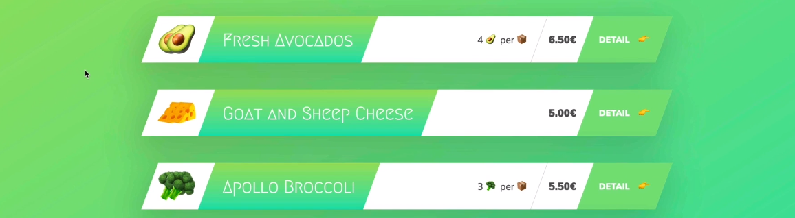

## Introduction to Node.js and NPM
### Install Node.js:

 

 
 After you install node.js on your local machine test it in CMD – node -v (should display the version) 
 ```html
 C:\Users\aygun>node -v         ->  v10.16.3 
 ``` 
 <br/>
 
### Introduction to Node.js and NPM

-	Node.js is a JavaScript Runtime build on Google’s open source V8 JavaScript Engine. 
-	Node.js enables JavaScript to be run in a different environment than just the browser.
-	The V8 Engine executes the code – parse it and runs it in Node.js

 
 <br/> 
 

### What is Node.js


#### Running JavaScript Outside the Browser

-	Start interacting with node in the command line; - we are going to use the build in terminal
	- Type-in **node**  -> this will open up *Node REPL* (Read-Evaluate-Print-Loop). It is very handy when we want to quickly test a JavaScript code snippet. 
    - To exit REPL type in .exit or Ctrl + D
    - Hit tab tab and you will see all the global variables that are available in Node
    - When you type in an underscore will give you the previous output to use.
    - Type in String. tab tag will give you the methods of the String class

#### Using Modules: Core Modules

-	Start a new .js file in the root directory
-	Type in some JavaScript code.
-	To run this file in the browser we would have to attach it to an html file;  
    but this is how we could run JavaScript in Node:  
	- In the Terminal -> command node and the name of the file.
-	More advanced features of Node would be reading files from the files system for example.  
    In order to that we would need to use a ***Node Module***	– all kind of functionality is stored in Modules; in this case it would be the *fs module (file stream)*.  
	To make use of these modules we ***require*** them into our code and then store the result of the requiring function in a variable.
const fs = require('fs');

#### Node Documentations:

  
<br/>


### Reading and Writing Files Synchronosly (blocking):


``` javascript
    const fs = require('fs');
	
// Read from file synchronosly:
	const textIn = fs.readFileSync('./txt/input.txt','utf-8');
	console.log(textIn);

// Write to file synchronosly:	
// ES6 syntax:
	const textOut = `This is what we know about the avocato: ${textIn}.\nCreated on ${Date.now()}`;
// Previous Syntax without the backstrings: - 'this is: ' + textIn;
	fs.writeFileSync('./txt/output.txt',textOut);
	console.log('File written');
```  
<br/>


### Blocking and Non-Blocking: Asynchronous Nature of Node.js

- Non-Blocking I/O model (asynchronous read function) - won't block the one single thread; the heavy work is done in the background; where it stays until it’s finished reading the data from the file.
- We then register a *callback function* to be called once the data is available.  
  All other users can perform their tasks in a single thread one after another while the file is still being read in the background. In PHP you get one thread for each user.
- A callback in our code does not make it automatically asynchronous. Passing functions in another functions is common in JavaScript. 


#### Callback Hell 
The callback model - function is called once the one before has finished its work; this can quickly lead to some hard to read and manageable code. 
#### Example:
The second file read depends on the first one; than the third file read depends on the second one; and then the finally we want to use the final data to write as a result.  
This makes it hard to read and reason about. This problem is called ***Callback Hell***. To solve this problem, we can use *ES6 Promises or ES8 async/await*. 
```javascript
const fs = require('fs');

// callback hell example:

fs.writeFile('start.txt', 'utf-8', (err,data1) => {
    fs.writeFile(`${data1}.txt`,'utf-8',(err,data2) => {
        fs.readFile('append.txt','utf-8',(err,data3) => {
            fs.writeFile('final.txt', `${data2} ${data3}` ,'utf-8', (err) => {
                if(err) throw err;
            });
        });
    });
});
```
-	Node was originally designed around callbacks and we still will be using them.
<br/>

### Reading and Writing Files Asynchronously

#### Example:
```javascript
	const fs = require('fs');

// Read from file Asynchronosly:
// the third parameter is a callback function() with two arguments;  
// (err if there was one, and the actual data itself.)

	fs.readFile('./txt/start.txt', 'utf-8', (err, data)  => { 
		console.log(data);
	});
	console.log('Will read file');
	
/*
OUTPUT:
The log() funcion will run before the callback function. 
NodeJS reads the file in the background; without blocking moves immediately to the next line. 
Once everything is read it will return to the call back funcion to run.   

> node index.js
	Will read file
	read-this
*/
```


#### Example: - Steps that depend on the result of the previous step.
```javascript
const fs = require('fs');

fs.readFile('./txt/start.txt', 'utf-8', (err, data1)  => { 
    fs.readFile(`./txt/${data1}.txt`, 'utf-8', (err, data2)  => { 
        console.log(data2);
        fs.readFile('./txt/append.txt', 'utf-8', (err, data3)  => { 
            console.log(data3);
        });
    });
});
```  


#### Example: - Write the last two strings to a file.
```javascript
const fs = require('fs');

fs.readFile('./txt/start.txt', 'utf-8', (err, data1)  => { 
    if(err) return console.log('ERROR');   //error handler 
    fs.readFile(`./txt/${data1}.txt`, 'utf-8', (err, data2)  => { 
        console.log(data2);
        fs.readFile('./txt/append.txt', 'utf-8', (err, data3)  => { 
            console.log(data3);
			
// Write to file Asynchronosly:
// we want to write data2 and data3 to a file.
// the third argument (callback) will not return data, so we only need err argument;
			
            fs.writeFile('./txt/final.txt', `${data2}\n${data3}`, 'utf-8', err => {  
                console.log('Your file has been written.');
            });
        });
    });
});
```
The arrow functions is an ES6 syntax. The difference between a standard function syntax is that the arrow function doesn't get its own this keyword. It uses the parents this keyword which is called lexical this keyword. The standard function syntax:
```javascript
	function(err, data1){
	  //a function always gets the this keyword. 
	}
```  
<br/>

### Creating a Simple Web Server
- Accepting request and sending back responses. - *Networking capability*
- Include the **http-module**
```javascript
const http = require('http');
```

- **Create the Server** - the first part.
```javascript
http.createServer((req,res) => {       // takes two args, request and response variable 
    res.end('Hello from the server');  // use tools of the request/response object 
});
```
- **Listen incoming request** - the second part.  
  In order to do that, save the result of ```createServer``` to a variable
```javascript
// create server
	const server = http.createServer((req,res) => { 
		res.end('Hello from the server'); 
	});
// use the server listen method()
	server.listen(8000, '127.0.0.1', () => {
		console.log('Listening to requests on port 8000');
	});
	
/*
> node index.js
Listening to requests on port 8000
*/
```  
##### Output: 
Run the node application; We can get to this URL on port 8000 on our computer :


*Note: To stop the server running => Ctrl + C*  
<br/>


### Routing
- Include the **url-model**
```javascript
const url = require('url');
```
*(Note: To select multiple word phrases in visual studio, highlight the word and press Ctrl + D)*

#### Example: - check path names and respond to that particular url
```javascript
const http = require('http');
const url = require('url');

const server = http.createServer((req,res) => { 
    const pathName =  res.url;                      // requested url from the page
    console.log(res,url);
    res.end('hello from the server');
    if(pathName === '/' || pathName === '/overview'){
        res.end('This is the OVERVIEW');
    }else if(pathName === '/product'){
        res.end('This is the PRODUCT');
    }
});

server.listen(8000, '127.0.0.1', () => {
    console.log('Listening to requests on port 8000');
});
```
##### Run the server:
> node index.js  
Listening to requests on port 8000

##### OUTPUT:


When there is a request that wasn’t handled in the code, the server will not respond, and the search wheel won’t stop spinning. To handle this problem, add another route within the else statement.
```javascript
const server = http.createServer((req,res) => { 
    const pathName =  req.url;

    if(pathName === '/' || pathName === '/overview'){
        res.end('This is the OVERVIEW');
    }else if(pathName === '/product'){
        res.end('This is the PRODUCT');
    }else{
        res.end('Page not found!')
    }
});
```
 A 404 is an http status code; so, we can also add the http status to the response.
```javascript 
    }else{
        res.writeHead(404);      //You can examine the server response in Dev tools(inspect). 
        res.end('Page not found!')
    }
```
A HttpHeader is a piece of information about the response *(metadata about the response)*. We can use ```writeHead()```to send back headers by adding objects as a parameter to the method. One of the standard headers is to inform the browser of the Content Type. When we set to Content Type to text/html, the browser will now expect some html.
We can also add our own headers in here and pass on data about the response.
#### Example:
```javascript
const server = http.createServer((req,res) => { 
    const pathName =  req.url;

    if(pathName === '/' || pathName === '/overview'){
        res.end('This is the OVERVIEW');
    }else if(pathName === '/product'){
        res.end('This is the PRODUCT');
    }else{
        res.writeHead(404, {
            'Content-type':'text/html',
            'my-own-header':'hello-world'
        });
        res.end('<h1>Page not found!</h1>')
    }
});
```

  
<br/>

### Building a (Very) Simple API

- **API** – A service from which we can request some data. 
<br/>
 
#### Example: 
In this example we are offering data about the products from a json file. This is the data that the API will send to the client when requested.  
**JSON** is a simple text format that looks like a JavaScript Object. Each object inside this array has a key of type string, and a value attached to it.  
A common use of JSON is to exchange data to/from a web server. When receiving data from a web server, the data is always a string. Parse the data with **JSON.parse()** , and the data becomes a *JavaScript object*.  
- First add another route(/api) to our project, and a simple placeholder for the response.
```javascript
const http = require('http');
const url = require('url');

const server = http.createServer((req,res) => { 
    const pathName =  req.url;

    if(pathName === '/' || pathName === '/overview'){
        res.end('This is the OVERVIEW');
    }else if(pathName === '/product'){
        res.end('This is the PRODUCT');
    }else if(pathName === '/api'){        // adding another route and a sample placeholder.
        res.end('This is an API');
    }else{
        res.writeHead(404, {
            'Content-type':'text/html',
            'my-own-header':'hello-world'
        });
        res.end('<h1>Page not found!</h1>')
    }
});
```

- Next, 
  - Read data from the data.json file, then
  - parse JSON into a JavaScript object, and then 
  - send back the result to the client.  

- When a file is requested, to find its location in the file system, we could access it with this type of code:  
  -  ```fs.readFile('./dev-data/data.json')```
  The dot (.) in node referse to the directory from which we run the node command in the terminal. If we run the node command somewhere else the dot would mean something else. (So for example if we started node from the desktop then the dot would mean the desktop).  
  Therefore, this approach is not ideal. 
- A better approach to locate the script that we want to execute in the files system :  
  - ***```__dirname```*** variable  
  All node.js scripts get access to this variable.  
  This variable always translates to the directory in which the script is located.(Note that only exception for this rule is when used with the required function).  
  To access the *__dirname* variable use a template string.  
  When sending back a response we need to tell the browser the ```Content-type```. In our case it’s JSON. 
```javascript
const fs = require('fs');
const http = require('http');

const server = http.createServer((req,res) => { 
    const pathName =  req.url;
	// Overview Page
    if(pathName === '/' || pathName === '/overview'){
        res.end('This is the OVERVIEW');
	// Product page
    }else if(pathName === '/product'){
        res.end('This is the PRODUCT');
    // API
    } else if (pathname === '/api') {
        // read the file	
        fs.readFile(`${__dirname}/dev-data/data.json`, 'utf-8', (err, data) => {
            // parse string data to javascript object
            const productData = JSON.parse(data);
            // header object
            res.writeHead(200, { 'Content-type': 'application/json' });
            // this sends back the string data 
            res.end(data);
            // this logs the javascript object
            console.log(productData);
        });
    // Not  Found
    }else{
        res.writeHead(404, {
            'Content-type':'text/html',
            'my-own-header':'hello-world'
        });
        res.end('<h1>Page not found!</h1>')
    }
});
```  
Restart the server, and add path /api to the url; this will return product data in string format to the browser, and logs the products data as a javascript objets to the console.  


    
<br/>


#### The issue with this code:
Each time a user makes that API request(/api), the server will read the file to send it back.  
A better solution would be to read the file once in the beginning and then each time a user hits this route, simply send back the data.  
<br/>
Take out the fs.readFile() method from the createServer code and use the *synchronous version of the file steam reader - fs.readFileSync()*, and place it to the top level. *Top Level code is only executed once in the beginning*.
<br/>

In other words:  
The Callback function ```http.createServer((req,res) => { … });*  )```  is the code that is executed every time a user makes a new request. The code that is outside the callback function, the top-level code, is only executed once when we start the program. Therefore, a better approach is to cut out the file reader from the callback function and place a synchronous file reader at the top-level.  
Updated code:  

```javascript 
// top-level code - use synchronous read function.
	const data = fs.readFileSync(`${__dirname}/dev-data/data.json`, 'utf-8');
	const dataObj = JSON.parse(data);	
	
	const server = http.createServer((req,res) => { 
		const pathName =  req.url;
		if(pathName === '/' || pathName === '/overview'){
			res.end('This is the OVERVIEW');
		}else if(pathName === '/product'){
			res.end('This is the PRODUCT');
		}else if(pathName === '/api'){		                   
			res.writeHead(200,{ 'Content-type': 'application/json'});
			res.end(data); 	 		      // sending back data from top-level.
		}else{
			res.writeHead(404, {
				'Content-type':'text/html',
				'my-own-header':'hello-world'
			});
			res.end('<h1>Page not found!</h1>')
		}
	});

```  
<br/>


### HTML Templating: Building the Templates (UI)

- Create an html template (overview.html file) that will display the data that is being read from a json file. 
- The fields in the json file will be dynamically placed on the html templates.  
  To do this, put a placeholder for the values of these fields inside the html and replace them later with actual data.
- Each product will also have its own detail page (template-product.html).
- Here are the fields that we have in our data.json file:
  
- The Product page:  
  Add placeholders for these fields; they should be eazy to recognized; for instance here we use 
```html
          <span class="product__emoji product__emoji--5"></span>
          <span class="product__emoji product__emoji--6"></span>
          <span class="product__emoji product__emoji--7"></span>
          <span class="product__emoji product__emoji--8"></span>
          <span class="product__emoji product__emoji--9"></span>
        </div>
        <h2 class="product__name">}</h2>
        <div class="product__details">
          <p><span class="emoji-left">🌍</span>From }</p>
          <p><span class="emoji-left">❤️</span>}</p>
          <p><span class="emoji-left">📦</span>}</p>
          <p><span class="emoji-left">🏷</span>$</p>
        </div>
```

- Next up modify the template-overview.html. (the opening page that displays all products).
  - The carts-container in this file includes a figure tag for each product. Since we don’t know how many products we have, we can’t tell how many figure tags we need initially. 
  - Create a template-card.html that will hold only one of those cards (one figure element - one product). Copy the figure element from the template-overview.html to template-card.html.  
  Delete all the figure tags from the template-overview.html and add a placeholder here for the products ``````. Later on replace the placeholder with as many cards as needed dynamically.  

template-overview.html:
```html
	  <body>
    <div class="container">
      <h1>🌽 Node Farm 🥦</h1>
      <div class="cards-container">
        
      </div>
    </div>
  </body>
```  
template-card.html:
```html
<figure class="card">
    <div class="card__emoji"></div>
    <div class="card__title-box">
      <h2 class="card__title"></h2>
    </div>
    <div class="card__details">
      <div class="card__detail-box ">
        <h6 class="card__detail"></h6>
      </div>
      <div class="card__detail-box">
        <h6 class="card__detail card__detail--price"></h6>
      </div>
    </div>
    <a class="card__link" href="/product?id=">      link with id 
      <span>Detail <i class="emoji-right">👉</i></span>
    </a>
  </figure>
 ```  

- Modify the a tag (Details Button) inside the template-card.html which will take us to the product-template. The “href” property has the path to the product page along with the product id number attached as a *query string*. The id placeholder will be replaced with the correct id number dynamically.  

```html
    <a class="card__link" href="/product?id=">
      <span>Detail <i class="emoji-right">👉</i></span>
    </a>
```  
<br/>


### HTML Templating: Filling the Templates

-	To replace the placeholders with the content, first save the template-overview.html in a variable.   
    - Each time there is a new request for the root (/) or (/overview) route, the template-overview.html will be read.  
	  This action can be done outside of the callback function (Just like reading the data); because the templates will always be the same. We can read them into memory at the start of the application; and modify the content later on when necessary.  
      So read all three templates synchronosly and save them to the top-level as const variables.  
	  When sending back the templates as a respond, don’t forget to declare the Content-type as html. 
```javascript
	const fs = require('fs');
	const http = require('http');
// SERVER

// top-level code:
// synchronosly read data and save in a variable
	const data = fs.readFileSync(`${__dirname}/dev-data/data.json`, 'utf-8');
	const dataObj = JSON.parse(data);  //stores an array of all the elements
// synchronosly read all three templates and save them in variables.
	const tempOverview = fs.readFileSync(`${__dirname}/templates/template-overview.html`, 'utf-8');
	const tempCard = fs.readFileSync(`${__dirname}/templates/template-card.html`, 'utf-8');
	const tempProduct = fs.readFileSync(`${__dirname}/templates/template-product.html`, 'utf-8');


	const server = http.createServer((req,res) => { 
		const pathName =  req.url;    
		// Overview page    
		if(pathName === '/' || pathName === '/overview'){
			res.writeHead(200,{ 'Content-type': 'text/html'});
			res.end(tempOverview);
		// Product page
		}else if(pathName === '/product'){
			res.end('This is the PRODUCT');
		// API
		}else if(pathName === '/api'){
			res.writeHead(200,{ 'Content-type': 'application/json'});
			res.end(data);
		// Not  Found
		}else{
			res.writeHead(404, {
				'Content-type':'text/html',
				'my-own-header':'hello-world'
			});
			res.end('<h1>Page not found!</h1>')
		}
	});

// use that server an on that call listen.
	server.listen(8000, '127.0.0.1', () => {
		console.log('Listening to requests on port 8000');
	});
```
Run the application in the server; type in the route for the overview template and open the page in the browser to see if everything is running as expected.
```
	PS C:\ . . . > node index.js
	             Listening to requests on port 8000
```  
The browser will display the page with the placeholder:
  
<br/>

- The next step is to replace the placeholer with the actual content 
  - Use the constant variable named dataObj (```const dataObj = JSON.parse(data);```) from the top-level, which stores an array of all the objects that are in data.json file.
  - Loop through this array and replace the placeholders in the template with the actual data.  
  We will loop through the object array with the ```map()``` function and store it in another array. Map accepts a callback function; this callback functions gets an argument(the current element). For each iteration we will replace the placeholder with the data. Adding ```join('')``` to the end of the statement will join all the html elements returned into a string. Create a function replaceTemplate() that will replace the rest of all the placeholders inside the html.  
 
 ```JavaScript
    // Overview page    
    if(pathName === '/' || pathName === '/overview'){
        res.writeHead(200,{ 'Content-type': 'text/html'});
        // replace the placeholders with actual data:
        const cardsHtml = dataObj.map(el => replaceTemplate(tempCard, el)).join('');
        const output = tempOverview.replace('', cardsHtml);
        res.end(output);
		
		
	// replace template function ( / / g means global - all of the placehodlers will be replaced.)
	const replaceTemplate = (template, product) => {
		let output = template.replace(//g, product.productName);
		output = output.replace(//g, product.image);
		output = output.replace(//g, product.price);
		output = output.replace(//g, product.from);
		output = output.replace(//g, product.nutrients);
		output = output.replace(//g, product.quantity);
		output = output.replace(//g, product.description);
		output = output.replace(//g, product.id);

		if (!product.organic) output = output.replace(//g, 'not_organic'); // -> a css class the will display:none;

		return output;
	};
 ```  
 Run the app in node; load the page in the browser -> Output: placeholders are replaced with content.
   
 <br/>
 
 ### Parsing Variables from URL's
 
 - Implementing the Product page (template-product.html):
   - Import the **url model**  
     ```const url = require('url');```
   - The DETAILS button for a product will add the product ID, which was replaced with actual data, to the queryString; and navigate to url path: /product  
     ```<a class="card__link" href="/product?id=">```  
	 Click on the DETAILS button and console log the output to see what properties the requested url has to offer.  
	 ```JavaScript
		 console.log(req.url);
	 /* OUTPUT - is the root:
		 /product?id=1
	 */
		 console.log(url.parse(req.url, true));  // -> 'true' arg parses a queryString.
	 /* OUTPUT - displays the properties for the requested url:
		Url {
		  protocol: null,
		  slashes: null,
		  auth: null,
		  host: null,
		  port: null,
		  hostname: null,
		  hash: null,
		  search: '?id=1',
		  query: [Object: null prototype] { id: '1' },
		  pathname: '/product',
		  path: '/product?id=1',
		  href: '/product?id=1' }
	 */	
	 ```

   - Next, we see that the returned object has two propteries that we can make use of: ```query``` and ```pathname```.  
     Create two variables with the same property names. The ES6 syntax to specify both variables would be:  
     **```const { query, pathname } = (url.parse(req.url, true));```** 
   - Build the Product page using these properties(url path and product id).
     Replace the placeholder in the product-template with the object property values.
     ```JavaScript
	 // Product page
     }else if(pathname === '/product'){
        // declare content type of the response 
        res.writeHead(200, { 'Content-type': 'text/html'});
        // get product object from the dataObj array
        const product = dataObj[query.id];
        // create the output
        const output = replaceTemplate(tempProduct, product);
        // send output as a response
        res.end(output);	 
	 ```

### Create Your Own Modules
- export functions from a module; import it to use it in a different file.
- In node.js every file is treated as a module.  
##### Example:
  - Assuming we will be using the ```replaceTemplate()``` function in multiple different javascript files.
  - Create a new folder "modules", and a file named "replaceTemplate.js"  
  - Cut out the replaceTemplate() funcion from the index.js and paste it in the replaceTemplate.js file.  
  - To **export** this function from the module we are going to use the module objects export propey **```module.exports```**. Simply assign an anonymous function to it.  
```JavaScript
	module.exports = (temp, product) => {
	  let output = temp.replace(//g, product.productName);
	  output = output.replace(//g, product.image);
	  output = output.replace(//g, product.price);
	  output = output.replace(//g, product.from);
	  output = output.replace(//g, product.nutrients);
	  output = output.replace(//g, product.quantity);
	  output = output.replace(//g, product.description);
	  output = output.replace(//g, product.id);
	  
	  if(!product.organic) output = output.replace(//g, 'not-organic');
	  return output;
	};	
```  
  - **Import** this function to the top of another module with the **```require()```** method.  
    In the require function the dot(.) means current root folder. 
  - Save this function in a const variable. Call the variable 'replaceTemplate' so we don't have to change the code for each instance it was used before.  
```JavaScript
	const replaceTemplate = require('./modules/replaceTemplate');
```
---

### Introduction to NPM and the package.json File
***npm***:  
- command line interface app and a software repository, that comes with node.js.
- used to install and manage open source packages.
- look up all the package and documentations that are included in the repository at npmjs.com
<br/>

- the first thing we do to start a new project is to start with:  
  ```npm init``` - this will create a ***package-json file***.  
  You will be asked:  
  package name: - node suggests a name you may use inside the paranthesis.  
  version:    
  description: type in a description  
  entry point: (index.js)  
  test command:  
  git repository:  
  keywords:  
  author:  

### Types of Packages and Installs
- **Simple/regular dependancies** are packages that contain some code that we can include in our own code. *Code upon which we build our application*. Our code will depend on them to work correctly.  
  For example, express is a dependency.
- **Development dependencies** - tools for development.   
  For example, testing tool, debugger,...

- **Slugify**
  - to make more readable URL's.  
    For example instead of */product?id=1* we could have */product/fresh-avocados* in the URL.
  - Look up documentation for usage  
  - **```npm install slugify```**  
    You can see in the package.json file that our first dependency is added:
	```JavaScript
	{
	  "name": "farm",
	  "version": "1.0.0",
	  "description": "Learning node.js",
	  "main": "index.js",
	  "scripts": {
		"start": "nodemon index.js"
	  },
	  "author": "Jonas Schmedtmann",
	  "license": "ISC",
	  "dependencies": {
		"slugify": "^1.3.5"
	  },
	  "devDependencies": {
		"nodemon": "^1.18.11"
	  }
	}
	```
- **nodemon** - a development dependancy.
  - nodemon automatically restarts the node application whenever we make changes to files in the working directory and save it.
  - Local install: **```npm install nodemon  --save-dev```**
  - nodemon will add a devDependencies and a scripts element to the package.json file:  
    ```JavaScript
	{
	  "name": "node-farm",
	  "version": "1.0.0",
	  "description": "Learning node.js",
	  "main": "index.js",
	  "scripts": {
		"start": "nodemon index.js"
	  },
	  "author": "Jonas Schmedtmann",
	  "license": "ISC",
	  "dependencies": {
		"slugify": "^1.3.5"
	  },
	  "devDependencies": {
		"nodemon": "^1.19.3"
	  }
	}
 	```
    To start the node application : **```npm run start```** or **```npm start```** instead of *node index.js*.
	<br/>
	
  - Global install: **```npm install nodemon  --global```**  
    To start the node application : **```nodemon index.js```** instead of *node index.js*.   
- The two different types of installs for packages:
  - Local - will only work in the project. npm saves package in project folder.
  - Global - packages will be available in any folder in our machine.

### 3rd Party Modules
When declaring modules in the node application we usually declare core modules first, then 3rd party modules and lastly our own modules.  
1. First install the module
2. require the module in the application with the ```require()``` function.

##### Example:
Require the slugify module which was installed ealier to the application; Look up documentation for methods and how to use it.
```JavaScript
// Create an array of all the slugs for the products 
const slugs = dataObj.map(element => slugify(element.productName, { lower: true }));
console.log(slugs);

/*OUTPUT:
Listening to requests on port 8000
[nodemon] restarting due to changes...
[nodemon] starting `node index.js`
[ 'fresh-avocados',
  'goat-and-sheep-cheese',
  'apollo-broccoli',
  'baby-carrots',
  'sweet-corncobs' ]
Listening to requests on port 8000
*/
```  
Here we see all five product slugs in the console. We could store these slugs in data.json, and then build the app to display the slug instead of the id in the URL.
<br/>


##### Check Outdated Packages:
- ```npm outdated``` -> this gives us a table of outdated packages
##### Installing Packages with certain version:
- ```npm install slugify@1.0.0```
##### Update Packages
- ```npm updated slugify```  
- Change the updating configuration by adding **^** infront of the version number after you installed a certain version; the ^ symbol means - accepting minor and patched releases. Run ```npm update slugify``` again. This will adds minor and patched releases to the current package. This is also the default.
- To get ALL versions use an asterisk - ```"slugify": "*1.3.5"```
- The safest updating configuration is to use a tilde **~** - ```"slugify": "~1.3.5"``` - for bug fixes.
##### Delete Packages
- To delte a package - ```npm uninstall express```
#### The node_modules folder:
- This folder contains all of the dependencies of your project.
- When you want to share your code with someone,  from one computer to another, you will never share this folder because you can easily get it from npm. There is no need to upload all of this code to gitHub, or dropbox for example.  
- This is how you get this folder to your project:
  - all you have to do is ```npm install``` -> This will read our package-json file and our dependencies and then download everything into a new node_modules folder.
  - Check out file **package-lock.json** -> this has a list of all the packages and the versions, also the dependancies of our dependancies.  
  *When you share your code, check here to make sure everyone is running the same versions of the packages.*
  <br/>
  


## Introduction to Back-End Web Development

#### How the Backend Works - What happens when we access a web page:

#### Front-end and Back-End

#### Static Websites vs Dynamic Websites

- Because of how powerful browser's have become on the client side, we see more and more websites based on API's.  
- API powered websites are similar to a dynamic websites. The big difference is that with API we only send the data to the browser, usually in JSON data format, and not the entire website(no html or css).  
- When building API powered websites, there is always these two steps - Building API and Consuming API.  
- The building phase of a website moved from the back-end to the front-end. This is why dynamic websites are also called Server-Side Rendered and Client-Side Rendered.  
For back-end developers it is much easier to build an API and let the front end people build the site. Node is great tool to build API's and dynamic server side rendered websites.  
API's can also be consumed by other clients than just the browser (native mobile apps).
#### Dynamic Websites vs API-Powered Websites


## How Node.js Works
### Events and Event Driven Architecture:
Node is built on an event driven architecture. This is how we can make use of the architecture in our code:  
- **Event Emitters**: are node.js objects. These emit named events when something has happened in the app. Like a request hitting a server; a timer expiring; file finishing to read. 
- **Even Listeners**: These events can then be picked up by event listeners, that we developers set up which will fire off the callback functions that are attached to each listener.  


**Example**:  


How node uses the event driven architecture, to handle server requests and the http module.
- When we want to create a server we use the createServer() method and save it to a server variable. Here the implementation is a little different.
```JavaScript
	const http = require("http");
	const server = http.createServer();

	server.on("request", (req, res) => {
	  console.log("Request received!");
	  res.end("Request received");
	});
```
- The ```server.on``` creates an event listener, and in this case for the request event. 
- So, lets say the server is running and a new request is made; 
  - the server acts as a Emitter and will automatically emit an event called request 
  -	then since we have a listener set up for this request, the callback function that we have attached to this listener will automatically be called; it will simply send some data back.  

It works this way because *the server is an instance of the node.js Even Emitter class*; so, it inherits all the event emitting and event listening logic.  

This event emitting logic is called ***The Observer Pattern***. The idea to have an observer, in this case the event listener, which keeps waiting/observing the subject that will eventually emit the event that the listener is listening for. The opposite of this pattern is functions calling other functions.  

The observer pattern has been designed to react rather then to call. The benefit to use this architecture is the fact that everything is more decoupled. We don’t have for example functions from the file system module calling functions from the http module. Instead these modules are nicely decoupled and self-contained.  
With Event Emitters, we can also set up multiple listeners for the same event.

### Events in Practice:
Example for 
- To use the build in node events we need to require the event module.
  ```JavaScript
  const EventEmitter = require("events");
  ```
- In order to create a new emitter, we are going to create an instance of that class.
  ```JavaScript
  const myEmitter = new EventEmitter();
  ```  
*Note: Event Emitters can emit named events, and we can than subscribe to this event(listen to them), and then react accordingly. This is like setting up an event listener on a DOM element, for example for clicking on a button.*   

- Make up an event name with the **```emit()```** method. Here for example we create an event for an online store. *This is the EMITTER (emits the event New Sales Event)*
  ```JavaScript
  myEmitter.emit("newSale");
  ```  
- Now we have to set up the listener for that event with the **```on()```** method and the callback function that will executed as soon as this event is emitted. *This on() is the OBSERVER; (it observes the emitter until it emits the New Sale Event.)*
  ```JavaScript
  myEmitter.on('newSale', () => {
    console.log('There was a new sale!');
  });
  ```
- Set up another listener for the same event. *This on() is also the OBSERVER; (it observes the emitter until it emits the New Sale Event.)*
  ```JavaScript
  myEmitter.on('newSale', () =>  {
    console.log("Customer name: Jonas");
  });
  ```  
  Run the file:  
  ```JavaScript
  OUTPUT:
	  > node events.js
	There was a new sale!
	Customer name: Jonas
	```  
Note that our EMITTER could also emit other events, like New Customer, or New Order or something like that and we could add LISTENERS for these as well.  
<br/>

We could also pass arguments to the event listeners, by passing them as additional arguments in the emitter; and have a listener that wants to use that inside the callback function.  
Example: here we pass the amount of items that are left.  
```JavaScript
// Set up listener for New Sales Event with arguments
	myEmitter.on("newSales", stockAmount => {
	  console.log(`There are now ${stockAmount} items left in stock`);
	});

// passing arguments with the New Sales Event
	myEmitter.emit("newSales", 9);
	OUTPUT:
		> node events.js
	  There are now 9 items left in stock
```
#### Using the Observer Pattern in Real-life:
 - Create a new class that inherits from the node event emitter
```JavaScript
	class Sales extends EventEmitter {
	  constructor() {
		super();
	  }
	}

	const myEmitter = new Sales();
```
**Example**:  
- demonstrates that the http module is based on event
- create a web server and listen to the event that it emits:
```JavaScript
	const http = require("http");
	const server = http.createServer();

	//when you see on() -> listenin to an event, here request event
	server.on("request", (req, res) => { 
	  console.log(req.url);
	  res.end("Request received");
	});

	// listening to another request event: (only 1 resonse possible.)
	server.on("request", (req, res) => {
	  console.log("Another request");
	});

	//listening to a close event:
	server.on("close", () => {
	  console.log("Server closed");
	});

	// start the server: 
	server.listen(8000, "127.0.0.1", () => {
	  console.log("Waiting for requests...");
	});
```  
Run the file in terminal:  
Output in the console: ```Waiting for requests...```  
The application is not shutting down, because the event loop is still waiting for IO.  
Make a request on port 8000 on the localhose url - http://127.0.0.1:8000/  
Here is the response in the borwser:  
  
Output in the console:
```JavaScript
/
Another request
/favicon.ico  		-> browsers automatically makes request for favicon.
Another request
```
**Note:**  
  When we use custom events in the application we have to emit the events ourself.  
  But when we are using a build in node modules, then these functions will emit their own events and all we have to do is to listen to them. 

### Intro to Streams
 - Streams are instances of the EventEmitter class
 - We can listend to many different events but the most important events for the Readable and Writeable Streams are:
   - data(when there is new piece of data to consume) 
   - end (when there is no more data to consume)
   - drain
   - finish
 - We can react to these events accordingly. 
 - There are also important functions that we can use on streams; for example the read() and pipe() - allows us to plug streams together,passing data from one stream to another. functions.
 
|Stream|Descripttion|Example|Important Events|Important Functions|
|------|------------|-------|:--------------:|:-----------------:|
|Readable Streams| Streams from which we can read(consume) data | http requests<br/>fs read streams | data<br/>end  | pipe()<br/>  read() |
|Writable Streams| Streams to which we can write data | http responses<br/>fs write streams | drain<br/>finish  | write()<br/>  end() |
|Dublex Streams| Streams that are both readable and writable | new web socket: comunication channel between client/server |   | |
|Transform Streams| Dublex streams that transform data as it is written or read | zlib Gzip creation|   | |  
<br/>

Note that these events and functions are for consuming streams that are already implemented; like the once in the example column.  
For example, node implemented the http requests and responses as streams; and so we can consume them with the events and functions for each stream.  

### Streams in Practice
```JavaScript
const fs = require("fs");
// shortcut for creating a server:
const server = require("http").createServer();

server.on("request", (req, res) => {
/* Solution 1
This is the easiest solution.
Simply read the file into a variable and send it to the client. 
*/
  fs.readFile("test-file.txt", (err, data) => {
	if (err) console.log(err);
	res.end(data);
  });
  /* The issue with this solution is that node has to load the entire file into memory, because only after that is ready it can then send that data. 
     This could be a problem when the file is big or when there are lots of request hitting the server. 
	 The node process will quickly run out of resouces. This would work fine if we create something locally but not in real production environment.
  */

  /* Solution 2: Streams
     We really don't need to read the file into a variable. We can just stream the content of the file straight to the client.
	 When we recieve chunks of data, we send it to the client as a response, which is a writable stream. 
  */
  const readable = fs.createReadStream("test-file.txt");
  readable.on("data", chunk => {
  // handle the data (chunk) write it to a writeable stream which is the response(the response is a writable stream).
    res.write(chunk);
  });

  // We also need to handle the event when all the data is read (stream is finished reading the data from the file.) - emit the end event. 
  readable.on("end", () => {
    res.end();
  });

  // We can also listen to the error event.
  readable.on("error", err => {
    console.log(err);
    res.statusCode = 500;
    res.end("File not found!");
  });

  /* There is also a problem with this approach. 
     The problem is that our readable stream is much faster than sending the result. This problem is called Back Pressure.
  */  

  /* Solution 3
     Make use of the pipe operator. This operator is available on all readable streams. 
	 This allows us to pipe the output of a readable steam right into the input of a writable stream. 
	 This will fix the problem of that pressure.
  */
  const readable = fs.createReadStream("test-file.txt");
  // this is the response:
    readable.pipe(res);
  });

server.listen(8000, "127.0.0.1", () => {
  console.log("Listening...");
});
```

